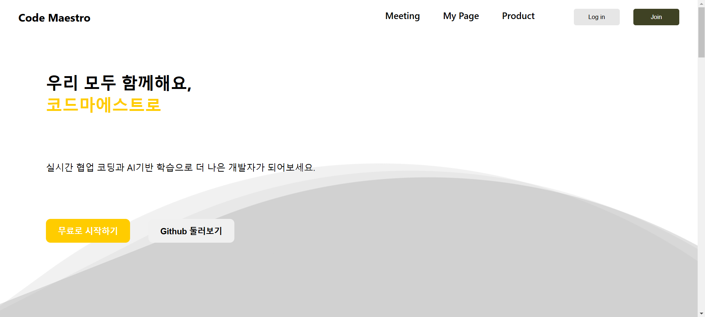

### 메인 페이지 구성
1. Header
- 로고
- Navbar(Meeting MyPage)
- 로그인, 회원가입 버튼

2. MainSelection
- 한줄 소개
- 기능 시작 버튼

3. Contents
- 서비스 기능들의 간단한 소개

4. Footer
- 구상 예정

### 수정 예정
- 물결 애니메이션 추가했는데 화면 하단에 물결 끝부분이 보이는 문제 해결 필요
- Contents 부분 배치 및 내용 수정 필요
- Footer 추가 예정

