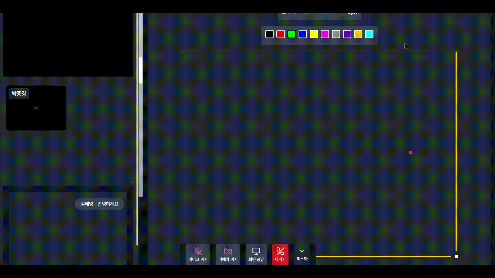
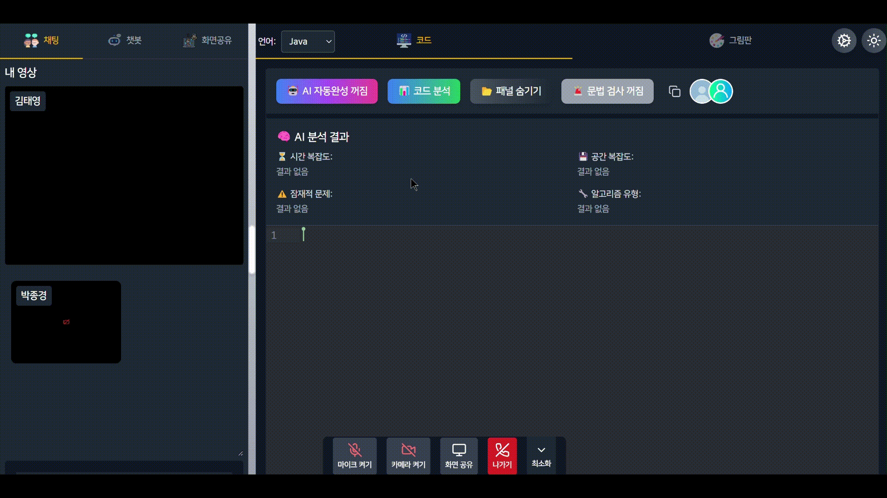
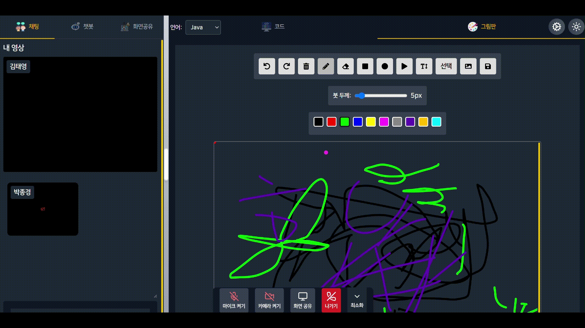

# CodeMaestro

**온라인 알고리즘 스터디 플랫폼**

> 삼성 청년 소프트웨어 아카데미(SSAFY)

> 개발기간 : 2025.1 - 2025.2

# 배포 주소

> 개발버전 : https://www.codemaestro.site

# 프로젝트 소개

## 배경

알고리즘 문제 풀이의 중요성이 날로 커지면서 많은 개발자들이 지속적으로 학습에 매진하고 있습니다. 이러한 흐름 속에서 다양한 알고리즘 스터디 그룹이 형성되고 있지만, 현재 온라인 스터디를 효율적으로 지원할 전용 플랫폼이 부족한 상황입니다. 기존의 화상회의 도구인 Zoom이나 Discord를 활용할 경우 여러 불편함이 존재하여, 이를 해결할 수 있는 전용 플랫폼의 필요성이 대두되었습니다.

CodeMaestro 는 온라인 알고리즘 스터디를 위한 공동 편집, 캔버스, AI 분석 기능 등을 제공하는 전용 플랫폼입니다. 이를 통해 개발자들이 보다 효율적이고 편리하게 학습을 진행할 수 있도록 지원하며, 협업 환경을 한층 강화합니다. CodeMaestro와 함께 더욱 체계적이고 효과적인 알고리즘 학습을 경험해보세요.

## 주요 기능

- 실시간 협업

  - **화상, 음성 및 화면 공유**: 원활한 의사소통 지원

  - **실시간 채팅**: 즉각적인 텍스트 커뮤니케이션 제공

  - **코드 동시 편집**: CRDT 기반의 실시간 코드 협업 가능

  - **캔버스 동시 편집**: 아이디어 시각화 및 공유 지원

- AI 지원 기능

  - **AI 코드 리뷰**: 코드 품질 개선 및 최적화 제안

  - **AI 챗봇**: 코드 추천 및 리뷰 제공, 실시간 응답 지원

  - **시간/공간 복잡도 분석**: 코드의 복잡도 분석 가능

  - **코드 자동완성**: 코드 패턴 분석을 통한 자동완성 기능

  - **문법 검사**: 실시간 오탈자 및 문법 오류 탐지

- 개발 환경 지원

  - **웹 기반 다언어 컴파일러**: 4개 언어 컴파일 및 성능 측정

  - **설치 없이 사용 가능**: 웹에서 바로 실행 가능

- 스터디룸 및 그룹 관리

  - **스터디룸 보안**: 회의실 잠금 및 초대 URL 제공

  - **스터디룸 관리**: 참가자 강퇴, 화상 및 음성 강제종료 기능 제공

  - **간편 로그인**: Kakao 계정 로그인 지원

  - **스터디 그룹 관리**: 출석 체크, 개인 기록 및 도전과제 기능

  - **스터디 그룹 활동 표시**: 참가자의 활동 내역 시각화

## 주요 기술

### 1.1 Frontend

#### 프로젝트 구조

- **Monorepo 구조 (yarn workspaces)**
  - my-code (메인 애플리케이션)
  - my-ide (회의실 애플리케이션)

#### 핵심 기술 스택

- 빌드 도구 및 개발 환경
  - Vite v6.0.5 (my-code)
  - React Scripts v5.0.1 (my-ide)
  - TypeScript v4.4.2
  - ESLint v9.17.0

#### 주요 라이브러리

- 공통
  - **React v19.0.0**
  - React DOM v19.0.0
  - OpenVidu Browser v2.31.0
  - Axios v1.7.9
  - TailwindCSS v3.4.17
- my-code (메인 앱)
  - Redux Toolkit v2.5.0 & Redux Persist v6.0.0
  - React Router DOM v7.1.1
  - Chart.js v4.4.7 & React-Chartjs-2 v5.3.0
  - DaisyUI v4.12.23
  - LiveKit Client v2.8.0
  - React Markdown v9.0.3
- my-ide (회의실)
  - CodeMirror 6 관련 패키지
    - 다양한 언어 지원 (@codemirror/lang-cpp v6.0.2)
    - 자동완성, 린트 지원 (@codemirror/autocomplete v6.18.4)
    - One Dark 테마 (@codemirror/theme-one-dark v6.1.2)
  - Yjs v13.6.23 & 관련 패키지
    - 실시간 협업 기능
    - WebRTC v10.3.0, WebSocket v2.1.0 지원
  - Konva v9.3.18 & React Konva v19.0.2
- 스타일링
  - TailwindCSS v3.4.17
  - PostCSS v8.4.49
  - Autoprefixer v10.4.20

#### 개발 도구

- ESLint v9.17.0
- TypeScript v4.4.2
- Concurrently v9.1.2 (멀티 프로세스 실행)

### 1.2 Backend

#### 기본 정보

- Java 17
- Spring Boot 3.4.2
- Spring Dependency Management 1.1.7

#### 주요 프레임워크 및 라이브러리

- Spring Boot Starters
  - Spring Boot JDBC v3.4.2
  - Spring Boot Web v3.4.2
  - Spring Boot WebSocket v3.4.2
  - Spring Boot WebFlux v3.4.2
  - Spring Boot Data JPA v3.4.2
- 보안
  - Spring Boot Security v3.4.2
  - Spring Boot OAuth2 Client v3.4.2
  - Spring Security OAuth2 JOSE v3.4.2
  - JWT (JSON Web Token) v0.12.3
    - jjwt-api v0.12.3
    - jjwt-impl v0.12.3
    - jjwt-jackson v0.12.3
- 통신 및 미디어
  - Spring Boot Mail v3.4.2
  - OpenVidu Java Client v2.31.0
  - Spring Cloud AWS v2.2.6.RELEASE
- 데이터베이스
  - MySQL Connector/J v8.2.0

#### 개발 도구

- Lombok

#### 빌드 도구

- Gradle (Java Plugin)

### 1.3 INFRA

- AWS
  - EC2
  - S3
- Jenkins
- Docker
- Docker Compose
- Nginx Proxy Manager

### 1.4 Database

- MySQL 8.0

### 1.5 Self-host 서버

- Judge0 v1.13.0
- Openvidu v2.31.0

## 협업 도구

- GitLab
- JIRA
- MatterMost
- Notion

## ERD

## 개발팀

<table>
  <tbody>
    <tr>
      <td align="center">
          
           
            <b>김태영(팀장, BE)</b>
         
      </td>
      <td align="center">
          
           
            <b>황지원(BE)</b>
         
      </td>
      <td align="center">
          
           
            <b>정보규(FE)</b>
         
      </td>
      <td align="center">
          
           
            <b>편정웅(FE)</b>
         
      </td>
      <td align="center">
          
           
            <b>이주영(FE)</b>
         
      </td>
      <td align="center">
          
           
            <b>김태경(INFRA)</b>
         
      </td>
    </tr>
  </tbody>
</table>

## 프로젝트 기능 소개

### 로그인

### 방 생성

### 그룹

### 동시편집 캔버스

### 동시편집 코드

### AI 기능

### 화면 공유

### 방장 권한

###
