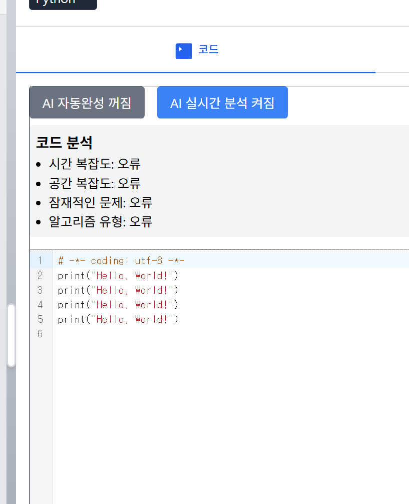
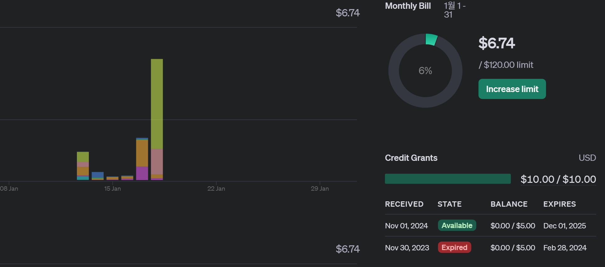
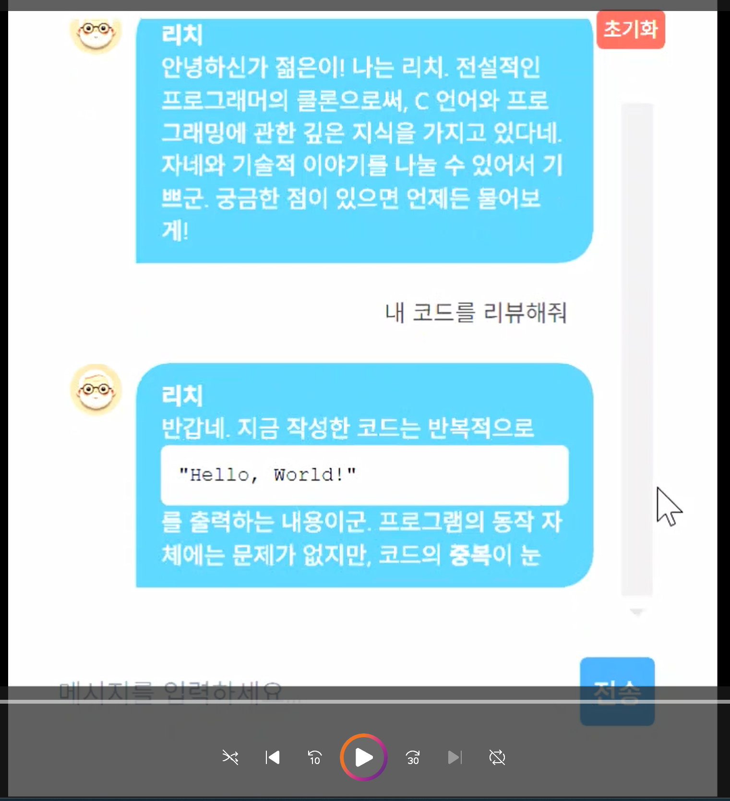
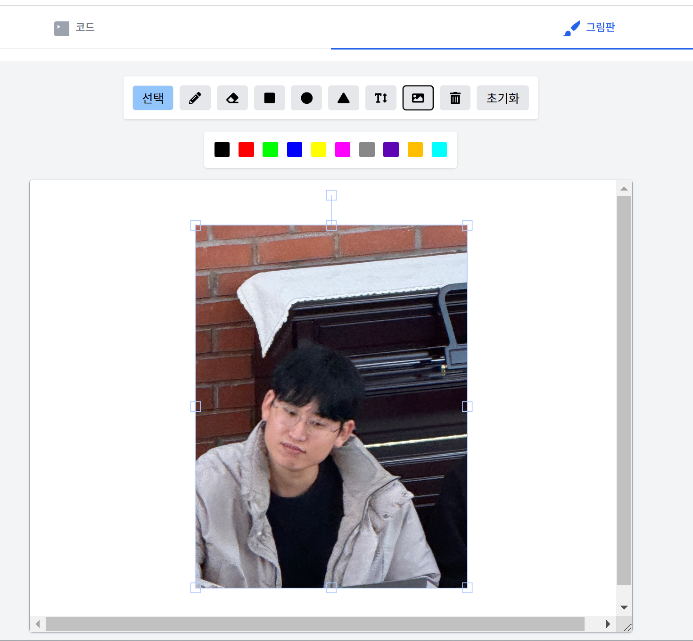

1. 리치 챗봇 강화 (stream으로 실시간으로 답변을 받고 (JSON을 파싱해야해 봇의 입력을 받는 코드를 대부분 뜯어고침), localstorage에 저장하여
새로고침해도 값이 남아있음 (초기화 버튼을 만듦), 코드 부분은 따로 코드칸에 작성하게 하여 가독성을 높임 

2. 실시간 AI 코드 분석 기능을 넣었고 실제로 작동까지 했으나 open ai key를 너무나 많이 (실시간이니..) 호출하여 발란스 잔액을 다 써버림 
10분만에 2달러를 다 썼다는 것은 이 기능을 빼야한다고 생각됨 .

3. fabric에 그림을 import하는 기능 추가 

