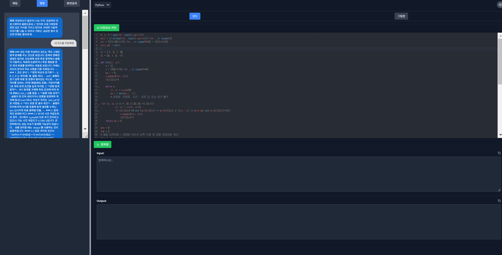
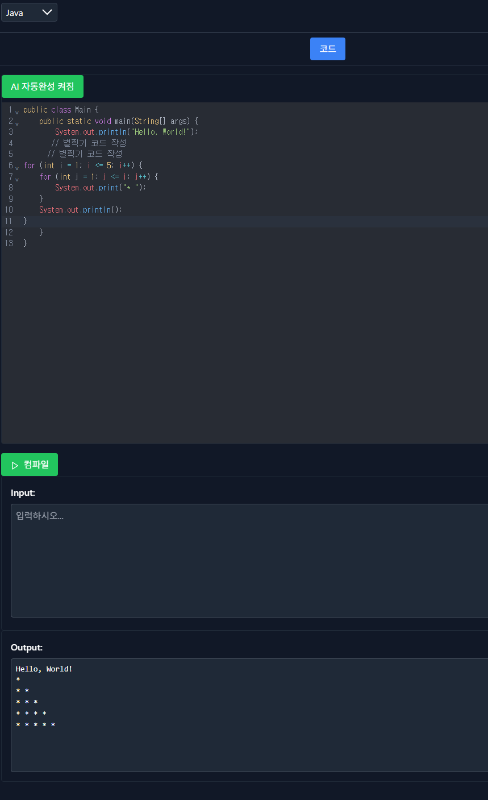
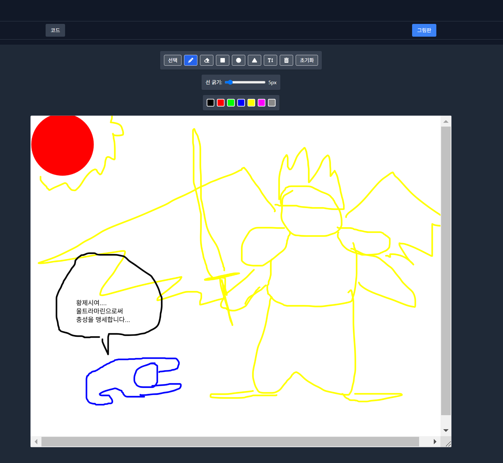
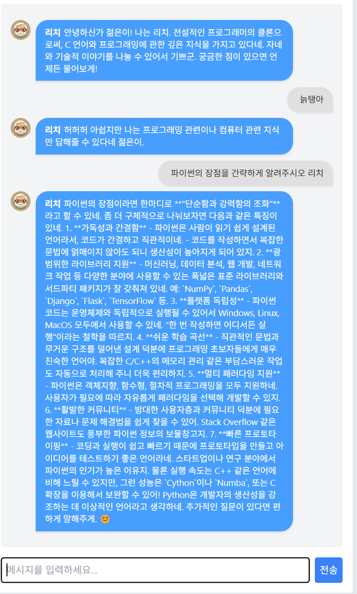

-------------------완료 작업----------------------

1. 서버리스 챗 봇 개발완료 (이중 질문 차단, 인격 부여(데니스 리치를 캐릭터화 한 리치), 프로그래밍 관련 질문만 받음, 챗봇에게 에디터에 써진 코드를 리뷰받고, 수정된 코드를 반영까지 에디터에 가능)

2. codemirror를 사용한 서버리스 코드 에디터 및 컴파일러러 개발완료 (AI를 이용한 코드 자동 수정 및 제안 - 심지어 주석으로만 프로그래밍 가능, 4개 언어 지원 및 컴파일 가능, 비동기 처리로 실시간 입력 가능 - 동기는 보안문제가 존재)

3. fabric을 통한 그림판 개발완료 (도형, 회전, 텍스트, 개체 개별 선택, 모두 비우기, 지우개, 색상)

4. 왼편에 3개의 탭, 오른편에 2개의 탭으로 페이지의 절반을 스플릿 바로 나누고 크기 조절 가능하게 프론트 페이지를 개발.

------------------개발 중인 작업----------------------

1. 챗봇 고도화 작업 중 (이미지 첨부 기능 및 첨부된 코드 이미지를 기반으로 에디터에 그대로 작성 해주는 기능, 스트림 설정으로 실시간으로 텍스트 출력, 누적된 대화 내용으로 채팅, localstorage 사용으로 대화 내용 저장 기능을 개발하고 테스트 중)

2. 코드 에디터 상에서 Python 에디터가 현재 선택한 에디터인데 자바 코드 입력 시, 자바로 에디터를 바꿔주는 기능 개발 중 

3. 코드 에디터 상에서 AI를 이용하여 실시간으로 시간 복잡도, 공간 복잡도, 코드 수정 제안 (버블소트에서 퀵소트 추천) 기능 또한 개발 중 

사진 첨부

챗 봇 고도화 진행 중 (문단 띄어쓰기, 간략화화)
